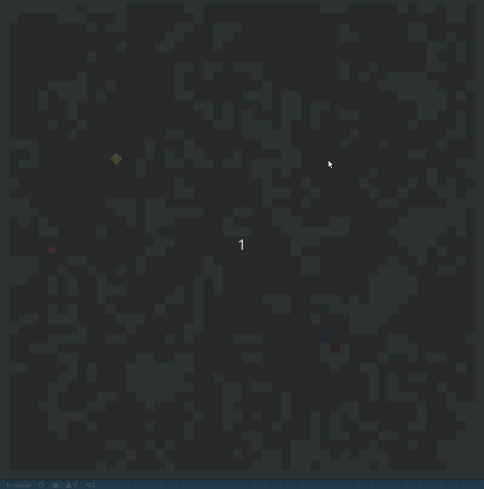

# Rust Game
<!-- Add Code Climate badge here -->

A survival tower defense game made in rust.



## Install

Open a terminal and do the following

1. Clone the repo using SSH or HTTPS

    Using SSH

    ```bash
    git clone git@github.com:rtulip/rustGame.git
    ```

    Using HTTPS

    ```bash
    git clone https://github.com/rtulip/rustGame.git
    ```

2. Change directory

    ```bash
    cd rustGame/src
    ```

3. Run the game to install dependencies and play

    ```bash
    cargo run
    ```

## Documentation
1. Navigate to the rustGame directory

    ```bash
    cd rustGame
    ```

2. Generate the documentation

    ```bash
    cargo doc --open
    ```

## How to Play

Move:

- `w` to move forward
- `cursor` for player direction

Attack: 
- `space` to attack
- `cursor` for direction

Place Turret: 
- `e` to place turret